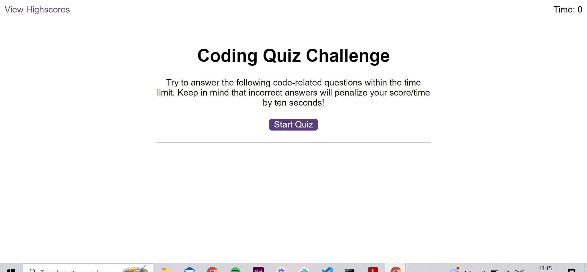

# code-quiz-challenge

Create a quiz with questions about coding using javascript (functions, local storage and event listeners)

A Javascript Quiz game created using Javascript (module 6 Challenge)

Answer the questions, as quickly as possible to get the best score. Wrong answers deduct time.

Link to live site: https://laurencemb.github.io/code-quiz-challenge/

Screen shot of deployed site: screenshot of deployed wepage:
)

Installation N/A

Credits N/A

License MIT
